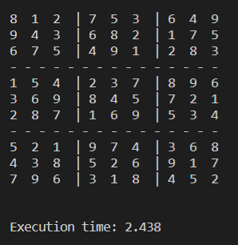
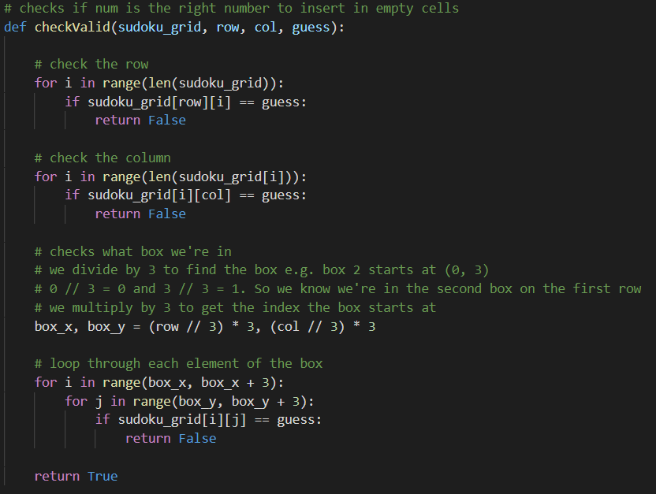

# Description
A Python program that solves sudoku problems with backtracking.
Tried this out with what's known as the 'world's hardest sudoko', created by Finnish mathematician Arto Inkala. The solution by the program matches the one found online.

# Program Steps
1. Find empty square
2. Try every number from 1 - 9
3. Check if it's valid (doesn't violate rules)
4. If it is, move on to next empty square
5. If not, backtrack to last-entered number and try more digits
6. Keep backtracking and entering in solutions until whole grid is complete

# Sudoku Rules
Sudoku is a logic-based number puzzle where you fill in numbers on a 9x9 grid. However, each number you fill in must not already be in the same row, column or 3x3 block.

# Screenshots
<h3>'World's Hardest Sudoku'</h3>

<h3>Sudoku Solution</h3>

<h3>The Actual Solution</h3>

<h3>Code for Validating Numbers</h3>

